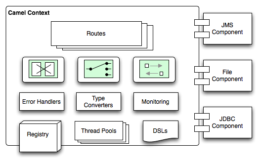

# Description: Introduction to Apache Camel

### Introduction
* Apache camel is a versatile open-source integration framework based on known Enterprise Integration Patterns.
* Apache camel can be used to define routing and mediation rules in a variety of domain-specific languages, including a 
  Java-based Fluent API, Spring or Blueprint XML Configuration files, and a Scala DSL. In short, Camel can get smart 
  completion of routing rules in an IDE, whether in a Java, Scala or XML editor.
* Apache camel uses URIs to work directly with any kind of Transport or messaging model such as HTTP, ActiveMQ, JMS, 
  JBI, SCA, MINA or CXF, as well as pluggable Components and Data Format options.
* Apache camel is light weight and easily configurable.
* Apache camel is a small library with minimal dependencies for easy embedding in any Java application.
* Apache camel uses the same API regardless of the kind of Transport used.
* Apache camel provides support for Bean Binding and seamless integration with popular frameworks such as CDI, Spring, 
  Blueprint and Guice. 
* Apache camel also has extensive support for unit testing your routes.
* Apache ActiveMQ uses Apache camel behind the scenes.

### Camel Architecture

### Camel Components

* Components are the various end points in a camel application.

### Camel Routes 
* Routes are the heart of a camel applications which handles and maintains the N number of routes.
* Camel Routes URI is used to define routes in camel.

### Camel Message Processors
* Processors are used to transform and manipulate messages.

### Camel Context

* Camel context is the soul of camel applications.
* All other the camel modules are enclosed inside a camel context.
* Camel context includes routes, components, processors etc.

### TODO
* Testing Camel Routes

