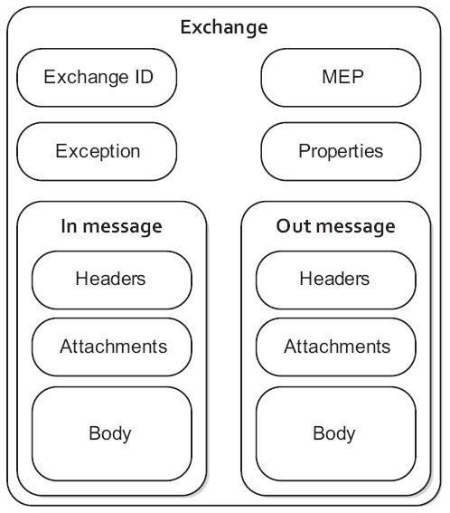

# Description: Camel Exchange Objects

### Camel Exchange Object
* The Camel API is influenced by APIs such as JBI specification, CXF which defines a concept called Message Exchange 
  Patterns (MEP for short).
* The MEP defines the messaging style used such as one-way (InOnly) or request-reply (InOut), which means you have IN 
  and optionally OUT messages. This closely maps to other APIs such as WS, WSDL, REST, JBI and the likes.
* The Exchange API provides two methods to get a message, either getIn or getOut. The getIn gets the IN message, and the 
  getOut gets the OUT message.

### Flow of an Exchange Through a Route

* The out message from each step is used as the in message for the next step.
* If there is no out message then the in message is used instead.
* For the InOut MEP the out from the last step in the route is returned to the producer. In case of InOnly the last out 
  is thrown away.

### Exchange Object
* Camel Exchange object is part of `camel-core` library.
* MEP is just a flag which can be InOnly or InOut.
* The exchange.getOut creates an out message if there is none. So if you want to check if there is an out message 
  then you should use exchange.hasOut instead.

### TODO
* Camel Exchange Methods: [Read](http://camel.apache.org/using-getin-or-getout-methods-on-exchange.html)