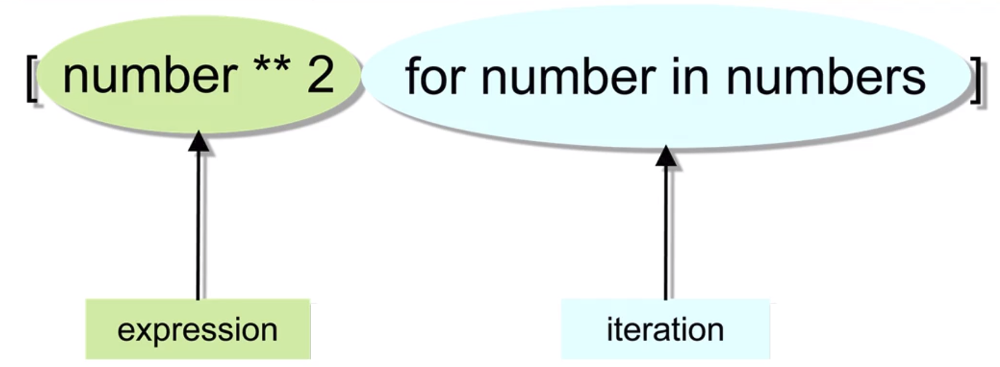
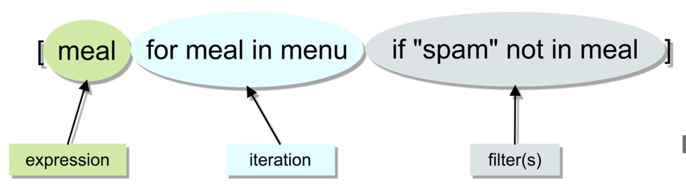
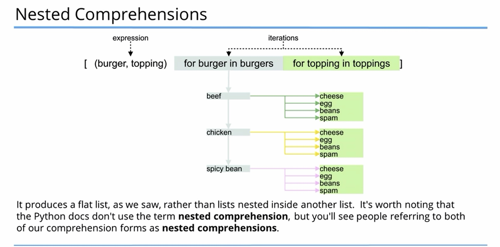
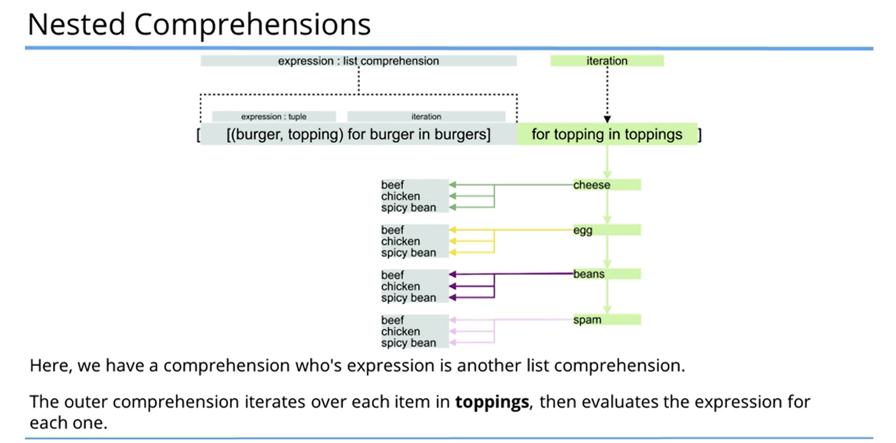

# Description: Comprehensions in Python

### Comprehensions
* List comprehensions provide a concise way to create lists.
* A list comprehension consists of brackets containing an expression followed by a for clause, then zero or more for
  or if clauses.
    - List Comprehensions
    
    
    
    - Conditional List Comprehensions
    
    

### Nested Comprehensions
* Nested Iterations: After getting the first burger - beef - the 2nd iteration part returns each of the toppings in 
  turn. Once all toppings have been iterated, the 1st iterator moves on to the next burger - chicken. The 2nd iterator 
  the runs through all the toppings again and then the 1st iterator move to the next burger. And so on.
  
    

* Nested Comprehension
    

### Advantages of Comprehensions
* List Comprehensions reduces lines of code.
* In certain cases, list comprehension is better as Python allocates the list’s memory first, before adding the elements 
  to it, instead of having to resize on runtime.
* Code using comprehensions is considered more 'Pythonic' and better fitting Python’s style guidelines.
