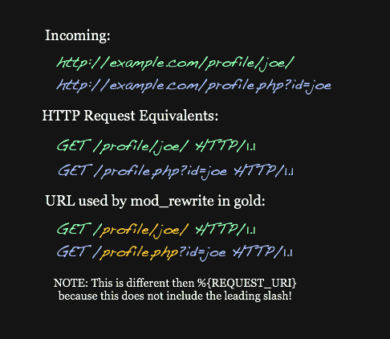
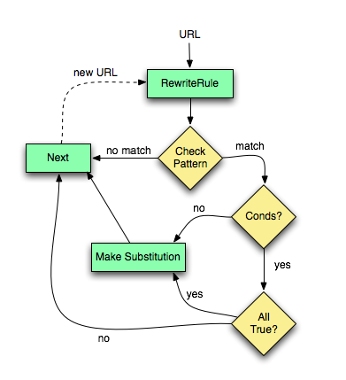
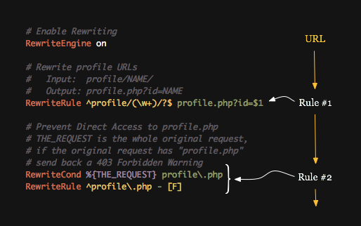
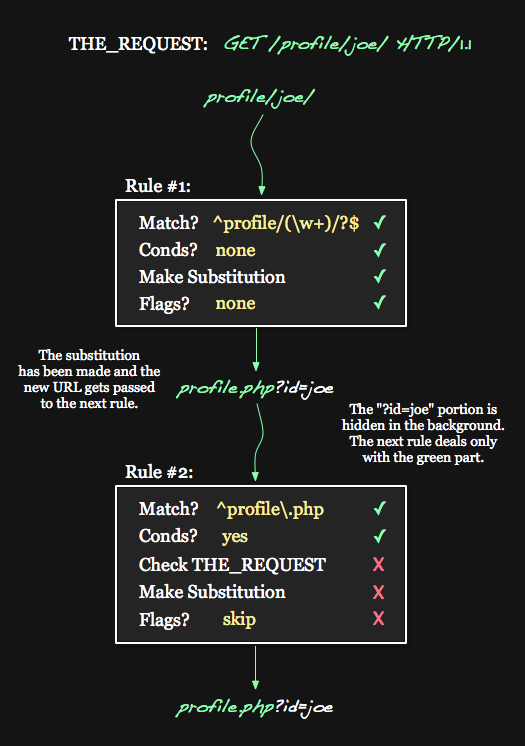
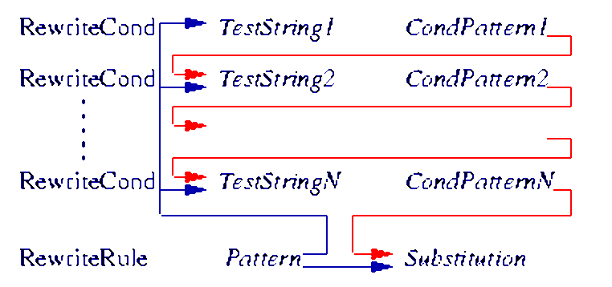

# Description: Apache Rewrite Module

### Introduction
* The `rewrite` is an Apache module that allows for server-side manipulation of requested URLs.
* It works as follows
    - There are a list of rules that are processed in order.
    - If a rule matches, it checks the conditions for that rule.
    - If everything is a go, it makes a substitution or action.
* Uses
    - The mod `rewrite` is most commonly used to transform ugly, cryptic URLs into what are known as 'friendly URLs' or 
      'clean URLs'.

### Check if mod `rewrite` is enabled
1. Check if mod `rewrite` is enabled using `apachectl`.
    - The following command will show all loaded modules.
    ```
    apachectl -t -D DUMP_MODULES
    ```
    - Check if mod `rewrite` is listed in the output.

2. [BUG] Check if mod `rewrite` is enabled using `apache2.conf`.
    - Add the following in apache2.conf.
    ```
    # Redirect everything under host example.local directory to `example.local/mod_rewrite.html`. 
    # Enable mod_rewrite for this virtual host
    <IfModule mod_rewrite.c>
        RewriteEngine On
        # [TODO] Fix bug here by adding domain
        RewriteRule .* /rewrite_test.html
    </IfModule>
    ```
    - Create `rewrite_test.html` with some content.
    - Opening any url like `http://example.local/`, `http://example.local/abc.html` etc should show the content of 
      `rewrite_test.html`.

3. Check if mod `rewrite` is enabled using virtual host conf.
    - Add the with following to a virtual host conf file (Say `example.local.conf`).
    ```
    # Redirect everything in this directory to `mod_rewrite.html`.
    <IfModule mod_rewrite.c>
        RewriteEngine on 
   	    RewriteRule /abc /rewrite_test.html
   	    RewriteRule /rewrite_foo.html /rewrite_bar.html
    </IfModule>
    ```
    - Create `rewrite_foo.html`, `rewrite_bar.html` and `rewrite_test.html` with different content.
    - Opening the url `http://example.com/abc` in a browser should show the content of `/rewrite_test.html`.
    - Opening the url `http://example.com/rewrite_foo.html` in a browser should show the content of `/rewrite_bar.html`.

4. Check if mod `rewrite` is enabled using .htaccess.
    - The .htaccess should be enabled in Apache in order to use this method. By default, it is not enabled.
    - If a rule [...] is added to .htaccess file, the directory prefix (/) is removed from the REQUEST_URI variable, as 
      all requests are automatically assumed to be relative to the current directory.
    - Create .htaccess with following content in any configured virtual directory and save it.
    ```
    <IfModule mod_rewrite.c>
        RewriteEngine on
        # Note the MISSING / before redirect because the path are relative to this virtual host.
        RewriteRule abc rewrite_test.html
        # Note the MISSING / before redirect because the path are relative to this virtual host.
        RewriteRule rewrite_foo.html rewrite_bar.html
    </IfModule>
    ```
    - Create `rewrite_foo.html`, `rewrite_bar.html` and `rewrite_test.html` with different content.
    - Opening the url `http://example.com/abc` in a browser should show the content of `/rewrite_test.html`.
    - Opening the url `http://example.com/rewrite_foo.html` in a browser should show the content of `/rewrite_bar.html`.

5. Check if `mod_rewrite` is enabled using PHP
    - PHP should be installed and configured to use this method.
    - Create a file info.php file with the following content and save it.
    ```
    <?php phpinfo(); ?>
    ```
    - Opening the url `http://example.com/info.php` which will also show all the modules enabled. Search for 
      `mod_rewrite` under `Configuration - apache2handler - Loaded Modules`.

### Enable & Disable `rewrite` module.
* Enabling or disabling modules CREATES or DELETES softlink under mods-enabled pointing to modules under mods-available.
```
sudo a2enmod rewrite                    # Enable mod_rewrite. This will CREATE softlink under mods-enabled.
sudo a2dismod rewrite                   # Disable mod_rewrite. This will REMOVE softlink under mods-enabled.

sudo service apache2 restart            # Restart apache after enabling or disabling modules.
```

### Rewrite Rules Flow
* Syntax
    - Syntax of RewriteRule

    
    
    - Syntax of RewriteCond

    

* 4 Parts of an HTTP request: `%{THE_REQUEST}`
    - The apache variables used mod `rewrite` has the format `%{APACHE_VAR}`. Example `%{THE_REQUEST}`, 
      `%{REQUEST_METHOD}` etc.
    - The mod `rewrite` added to a .htaccess file, works with the `%{REMOTE_URI}` portion but without the leading slash.
         
    

* The 'URL Part' that mod `rewrite` acts on inside a `.htaccess` file is highlighted in gold/yellow

    

* Flow of execution across multiple rules in a .htaccess file

    

* Flow of overall execution in Apache

    
    
* Each `RewriteCond` is associated with a single `RewriteRule`.

    

* GREEN URL flow for the above 2 rules
    - At the top is `THE_REQUEST` variable. Unlike many of the Apache variables, during the duration of the request, 
      this variables value will never change.
    - That is one of the reasons why Rule #2 uses %{THE_REQUEST}. 
    - First Rule: Underneath THE_REQUEST, we see the GREEN URL Part going into the first rule.
        - The URL matches the pattern.
        - There are no conditions, so it continues.
        - The substitution is made.
        - There are no flags, so it continues.
        
    
    
    - After making it through the first rule, the URL has changed. The total URL has been rewritten to 
      `profile.php?id=joe`, which Apache then breaks down and updates many of its variables. 
    - The `?id=joe` portion gets hidden from us and `profile.php`, the new 'URL Part', continues into the second rule.
    - Second Rule: 
        - The URL matches the pattern.
        - There are conditions, so we will try the conditions.
        - THE_REQUEST does not contains profile.php, so the condition fails.
        - Because a condition failed, we ignore the substitution and flags.
        - The URL is unchanged by this rule. 
    - Finally `profile.php?id=joe` is fetched after evaluating all the rules.

* BLUE URL flow for the same 2 rules

    
    
    - First Rule: 
        - The blue 'URL Part' enters Rule #1
        - The URL does not match the pattern.
        - Everything else is ignored and the URL proceeds unchanged.
        
    - Second Rule
        - The URL matches the pattern.
        - There are conditions, so we will try the conditions.
        - `THE_REQUEST` contains `profile.php`, so the condition passes.
        - We can make the substitution.
        - `-` is a special substitution that means: don’t change anything.
        - There are flags on the rule, so we process the flags.
        - There is a F flag, which means return a forbidden response.
        - A 403 Forbidden response is sent to the client.
    - Note
        - In order for the substitution to work, all of the conditions have to pass.
        - Example of multiple rewrite conditions      
    
        
        
        - Example of multiple rewrite conditions flow (Not related to above conditions)
    
        

* Best Practices
    - When working with mod `rewrite` and creating new rules, always begin with a simple, dumbed down version of the 
      rule, and work your way up to the final version. Resist the urge to do everything at once. The same applies for 
      conditions. 
    - Add rules and conditions one at a time. 
    - Test often!
        - Positive Cases: Test for rules that passes.
        - Negative Cases: Test for rules that fails.

### Examples of RewriteRules
* Note
    - Assume that the website’s domain is example.com. 
    - This domain name is important because it affects the `HTTP_HOST` variable, as well as specifies a redirect URL to 
      another file on the website.

* Remove `www`
    - Positive Case: If the incoming URL had been `http://www.example.com/user/index.html`, then HTTP_HOST would have been set to 
      `www.example.com` and the rewrite would trigger, creating `http://example.com/user/index.html`.
    - Negative Case: If the incoming URL had been `http://example.com/user/index.html`, then HTTP_HOST would have been 
      `example.com`, the condition would fail, and the rewrite engine would proceed with the URL unchanged.

    ```
    RewriteEngine on 
    RewriteCond %{HTTP_HOST} ^www\.example\.com$ [NC] 
    RewriteRule ^(.*)$ http://example.com/$1 [R=301,L]
    ```
    - The substitution is a full URL (it starts with http://).
    - The substitution contains $1, which was captured earlier.
    - The [R=301] flag redirects the browser to the rewritten URL. This is a hard redirect in the sense that it forces 
      the browser to load the new page and update its location bar with the new URL.
    - The [L] flag indicates that this is the last rule to parse. Beyond this line, the rewrite engine should stop.

* Forbid Hotlinking
    - Hotlinking, or Inline Linking, is the term used to describe one site leeching off of another site.
    - Usually one site - the Leecher - will include a link to some media file (let[s say an image or video) that is 
      hosted on another site, the Content Host. In this scenario, the Content Host’s servers are wasting bandwidth 
      serving content to some other website.
    - The most common and basic approach to preventing hotlinking is to whitelist a specified number of websites, and 
      block everything else. 
    - To determine who is requesting the content from your site, check the referrer. The HTTP_REFERER header is set by 
      the browser or client that is requesting the resource.
    - Ultimately, is not 100% reliable, however, it's generally more than effective at ceasing the majority of 
      hotlinking.

    ```
    # Give Hotlinkers a 403 Forbidden warning.
    RewriteEngine on
    RewriteCond %{HTTP_REFERER} !^http://example\.net/?.*$ [NC]
    RewriteCond %{HTTP_REFERER} !^http://example\.com/?.*$ [NC]
    RewriteRule \.(gif|jpe?g|png|bmp)$ - [F,NC]
    ```
    - The RewriteRule is checking for the request of a file with any popular image extension, such as .gif, .png, or 
      .jpg/jpeg. Add other extensions to this list to protect .flv, .swf, or any other files.
    - The domains which are allowed to access this content are `example.net` and `example.com`.
    
* Site Moved Permanently
```
# Site moved permanently
RewriteCond %{HTTP_HOST} ^www.domain.com$ [NC]
RewriteRule ^(.*)$ http://www.domain2.com/$1 [R=301,L]
Rewrites domain.com to domain2.com
```

* Page Moved Temporarily
```
RewriteRule ^page.html$ new_page.html [R,NC,L]
Rewrites domain.com/page.html to domain.com/new_page.html
```

* Sample Rule for Nice URLs
```
# Nice URLs (no query string)
RewriteRule ^([A-Za-z0-9-]+)/?$ categories.php?name=$1 [L]
Rewrites domain.com/category-name-1/ to domain.com/categories.php?name=category-name-1
```

