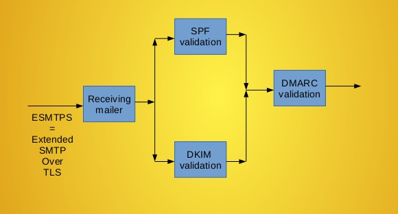

# Description: Introduction to SPF, DKIM and DMARC

### Holy Trinity of Email Delivery
1. SPF: SPF (Sender Policy Framework) is an email validation protocol designed to detect and block email spoofing by 
   providing a mechanism to allow receiving mail exchangers to verify that incoming mail from a domain comes from an IP 
   Address authorized by that domain's administrators.
2. DKIM: DKIM (Domain Keys Identified Mail) is an email authentication method designed to detect email spoofing. It 
   allows the receiver to check that an email claimed to have come from a specific domain was indeed authorized by the 
   owner of that domain.
3. DMARC: DMARC (Domain-based Message Authentication, Reporting and Conformance) is an email-validation system designed 
   to detect and prevent email spoofing. DMARC is built on top of two existing mechanisms, SPF and DKIM. It allows the 
   administrative owner of a domain to publish a policy on which mechanism (DKIM, SPF or both) is employed when sending 
   email from that domain and how the receiver should deal with failures. Additionally, it provides a reporting 
   mechanism of actions performed under those policies.

### SPF, DKIM and DMARC Flowchart

    
### TODO
* None
