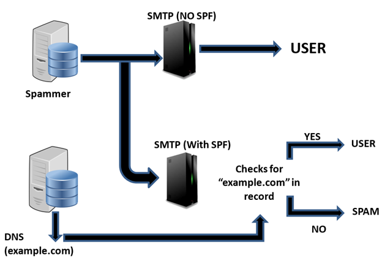
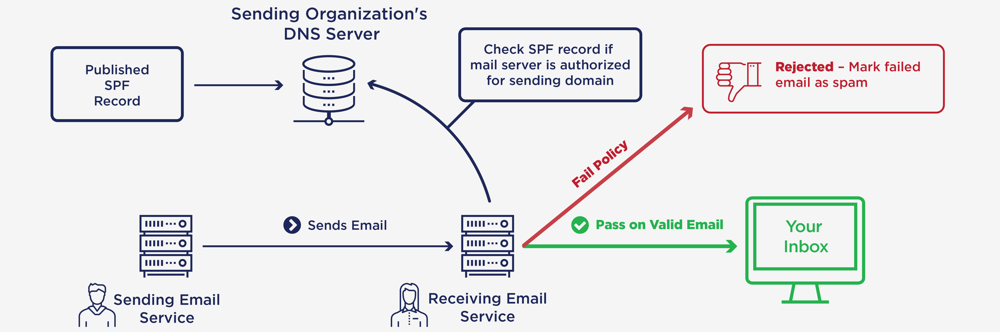

# Description: Senders Policy Framework (SPF)

### Introduction to SPF
* SPF is an email validation protocol designed to detect and block email spoofing by providing a mechanism to allow 
  receiving mail exchangers to verify that incoming mail from a domain comes from an IP Address authorized by that 
  domain's administrators.
* The list of authorized sending hosts and IP addresses for a domain is published in the Domain Name System (DNS) 
  records for that domain in the form of a specially formatted TXT record.
* Email spam and phishing often use forged "from" addresses and domains, so publishing and checking SPF records can be 
  considered one of the most reliable and simple to use anti-spam techniques.
* SPF configurations ONLY involves DNS Servers changes. No changes are to be made on the mail server.

### SPF Flowchart

### SPF Architecture

### Features of SPF
* [Good] Recognizes spoofed e-mails sent to us from other domains.
* [Good] Recognizes spoofed e-mails sent to others from own domain.
* [Good] It's easy to deploy as there is nothing to configure on mail server. Only DNS changes are required.
* [Bad] Does NOT prevent someone from sending emails from the own domain.
* [Bad] Depends on the transit servers.
* [Bad] Whenever message is forwarded, SPF breaks. This can be partially solved by SPF:SRS.

### Example SPF Records
* TODO

### SPF or Sender Policy Framework
* This lists down which IP Addresses are allowed to send emails from my domain.
* How does it work
    - `TXT @company.com ,,v=spf1 mx=all`
        - where `v=spf1` means it's an SPF record.
        - From my domain, only my mail exchangers (MX Record in my DNS points to it) can send out emails, those are my email servers.
    - `,,v=spf1 a mx -all"`
        - From my domain, only my MXs and mail A record of my domain can send out e-mails (company.com).
    - `,,v=spf1 a:mailers.company.com mx -all`
        - From my domain, only my MXs and all the IP addresses with A record of mailers.company.com can send out e-mails.
    - `,,v=spf1 ip4:62.77.84.0/24 mx -all`
        - From my domain, only CIDR network 62.77.84.0/24 can send out emails.
    - `,,v=spf1 mx include:vendor.com -all`
        - From my domain, only my MX and all servers allowed by SPF record of the domain vendor.com
    - `TXT @company.com ,,v=spf1 mx ~all`
        - From my domain, only my mail exchangers (MX records in my DNS points to it) can send out emails, those are my 
          mail servers.
    - Tilde (~) means, that domain, or their SPF record is in the transition period which means the admin believes that 
      valid messages can be delivered from other than listed IPs.
        - It is up to the other (receiving) side, how it will   handle this so called soft-fail.

### TODO
* None
