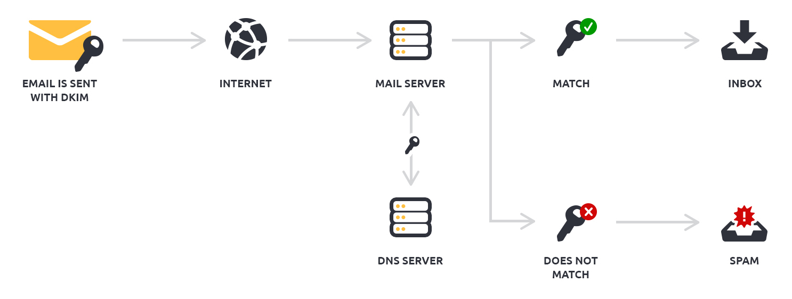
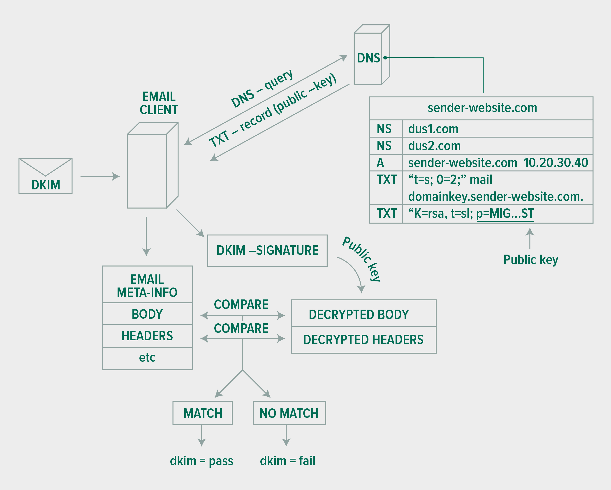

# Description: DKIM

### Introduction to DKIM
* DomainKeys Identified Mail (DKIM) is an email authentication method designed to detect email spoofing. 
* DKIM allows the receiver to check that an email claimed to have come from a specific domain was indeed authorized by 
  the owner of that domain.
* DKIM makes use of asymmetric key cryptography. Sending server signs messages (exactly the part that is not dependant 
  on SMTP Envelope) with its private key. Receiver verifies using the public key.

### DKIM Communication Flow
* Email senders create DKIM signatures and attach it to the emails.
* Email receivers verify the DKIM signatures attached in the emails. Each DKIM signature contains everything needed to 
  verify signatures.
* Changes have to be made on the mail server as well as DNS to make DKIM work.



### DKIM Architecture


#### DKIM Signature Creation
1. Normalise email content by removing trivial bits like extra space at the end of email etc.
2. Create hashes of email body and headers.
3. Sender has access to private key.
4. Sender creates crypto signature.
5. DKIM Signature is added to the email. DKIM signature has all the details needed to verify.
6. Email with DKIM signature is sent on its way. 

#### DKIM Signature Verification
1. Normalise email content by removing trivial bits like extra space at the end of email etc.
2. Create hashes of email body and headers.
3. Retrieve public key from the DNS. 
4. Crypto-signature in DKIM-signature is verified.
5. DKIM signature verification might fail due to multiple reasons,
    - Email might be real but modified in transit.
    - Email might be real but sender isnt attaching DKIM-signature to all email.
    - Email might be fake and carrying fake DKIM-signature.

### Features of DKIM
* [Good] DKIM recognizes spoofed e-mails.
* [Good] DKIM recognizes spoofed e-mails from own domain.
* [Good] DKIM is intended to prevent forged sender addresses in emails, a technique often used in phishing & email spam.
* [Good] DKIM ensures that message integrity/content is preserved.
* [Good] DKIM can survive forwarding.
* [Bad]  DKIM does NOT prevent sending emails from the same domain.
* [Bad]  Every server (or at least one in chain) sending messages from our domain has to be properly configured and has 
         to run software the supports DKIM.

### DKIM Record Syntax
```
       Name (DKIM Record)     | TTL  | Type | Value 	
+--------------------------------------------------------------------------------------+
| mail._domainkey.example.com.  300    TXT    "v=DKIM1\;p=MIISFNS...." "Another Key"   |
+--------------------------------------------------------------------------------------+
``` 
* The public key is with the other supporting instructions stored in the TXT record on the DNS server. 
* Key: The general syntax for the key/name is `selector._domainkey.company.com`.
    - **Selector**
        - The `mail` is the selector.
        - There can be more selectors, different for each sending server, or multiple selectors for one sending server.
        - It is a good practise to change the selectors (keys) after some time (say 6 months).
    - **_domainkey**: Hardcoded value. 
    - **Domain Name**
        - The `example.com.` is the domain for which DKIM key is being defined.
* Value
    - Signing and Verification Algorithms
        - Two algorithms are defined by this specification at this time: rsa-sha1 and rsa-sha256. 
        - The rsa-sha256 algorithm is the default if no algorithm is specified. 
        - Verifiers MUST implement both rsa-sha1 and rsa-sha256. 
        - Signers MUST implement and SHOULD sign using rsa-sha256.
    - Key Sizes
        - Since short RSA keys more easily succumb to off-line attacks, signers MUST use RSA keys of at least 1024 bits 
          for long-lived keys. 
        - Verifiers MUST be able to validate signatures with keys ranging from 512 bits to 2048 bits, and they MAY be 
          able to validate signatures with larger keys.
         
### DKIM Record Examples
* Example:
```
# Used by application
Name    : application._domainkey.example.com.
Type    : TXT
TTL     : 300
Value   : "v=DKIM1; k=rsa; p=MIGfMA0GCSqGSIb3DQEBAQUAA4GNADCBiQKBgQD9VvxhX10N5HMQs10UU5IlmHK95dpJ8OovWOpbHa/F1KISeJJPTHvVizjDthwTOlApPyWdc+u7LorQzwtIXAOc4Xxoe1hTkXZAFbobyXCuBMT/TlvqYt5b1pxbyirlzKjDChnB2WRR8PDfa9KuNcn1Fm3nzj80+LR/q6C9PZG+hwIDAQAB"

# Used by google
Name    : google._domainkey.example.com.
Type    : TXT
TTL     : 300
Value   : "v=DKIM1; k=rsa; p=MIGfMA0GCSqGSIb3DQEBAQUAA4GNADCBiQKBgQDGJ8KmHp08xevm99mZllxOP24fBk9rcaj4Pzn4dAEbQvqAfLj6XpBUQEa0xPvODyN2IkCvgi6iqVYyFph2Q5zIFrc7Y1nbvxIu7pMcSbH9qBNSBDfJOkJVx2K3y5V+hPgxWDN4F83r0OfjLCgGEmRLi0eyAugGHb+kLSQ37m/dFwIDAQAB"
``` 

### DKIM Verification
* Gmail will show "signed-by" field if DKIM verification passes.

### TODO
* None
