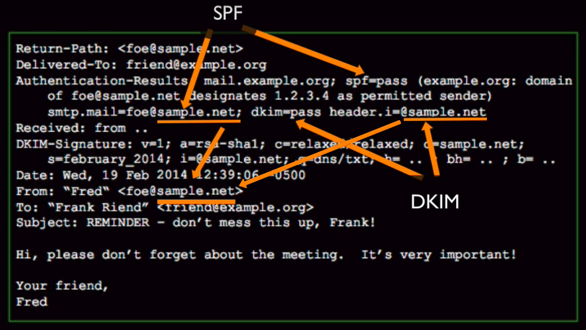
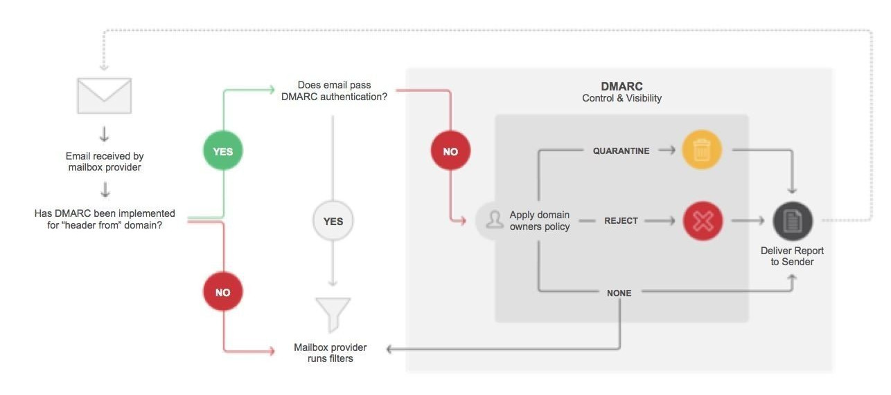
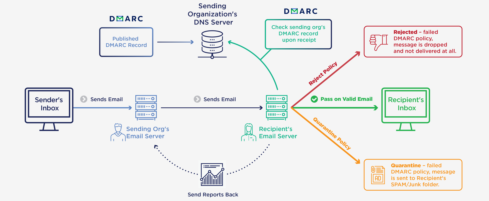

# Description: Introduction to DMARC

### Introduction to DMARC
* Domain-based Message Authentication, Reporting and Conformance (DMARC) is an email-validation system designed to 
  detect and prevent email spoofing. It is intended to combat certain techniques often used in phishing and email spam, 
  such as emails with forged sender addresses that appear to originate from legitimate organizations.
* DMARC is built on top of two existing mechanisms, SPF and DKIM. SPF and DKIM can associate an email with a domain. The
  stable, domain-level identifiers that SPF and DKIM produce are called 'Authenticated Identifiers'.DMARC ties together 
  'Authenticated Identifiers' with the domain found in the From: header of the email.
  
    

* DMARC coordinates the results of DKIM and SPF and specifies under which circumstances the From: header field, which is 
  often visible to end users, should be considered legitimate.
* DMARC additionally provides a reporting mechanism of actions performed under the SPF and DKIM policies.

### DMARC Communication Flow

### DMARC Architecture

### Features of DMARC
* DMARC stands for Domain-based Message Authentication, Reporting & Conformance.
* Combines SPF and DKIM
* From sending perspective there is nothing to configure on the server, similar situation as with SPF = it's just a DNS 
  record telling how should receiving server handle message which would (or wouldnt) comply to SPF and/or DKIM.
* Nothing to configure on the mail server

### DKIM Record Syntax

### DKIM Record Examples

### Example of DMARC Record
* TODO

### TODO
* None
